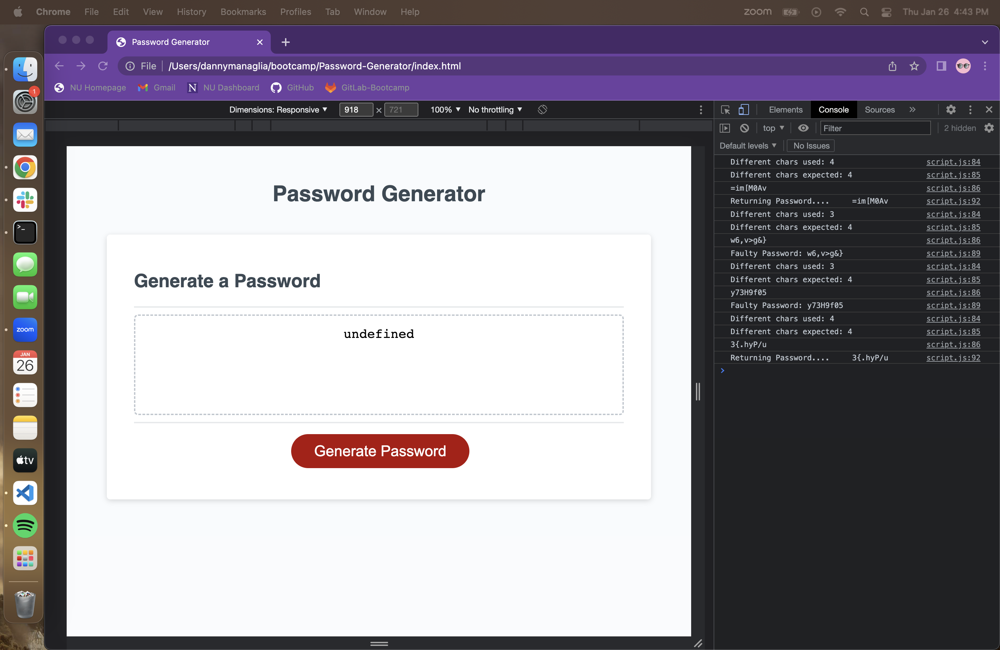
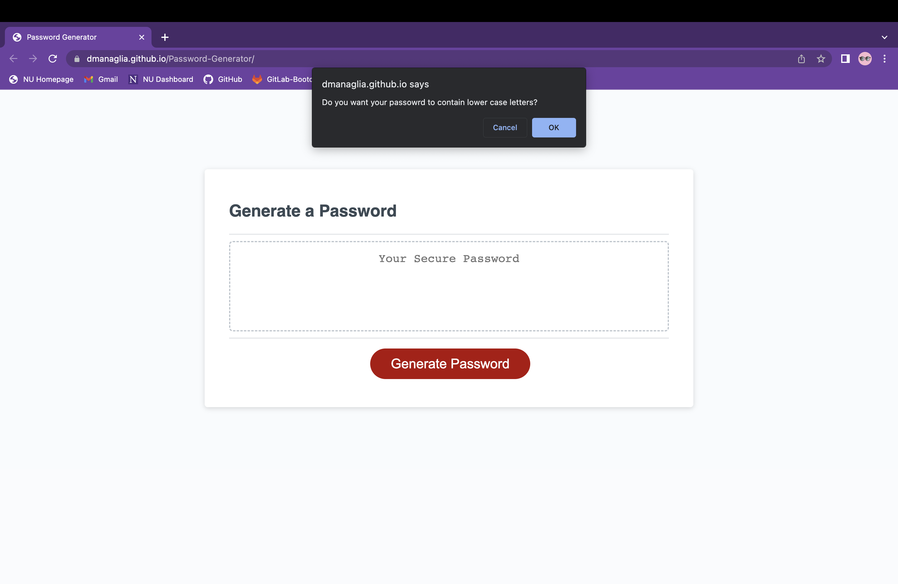
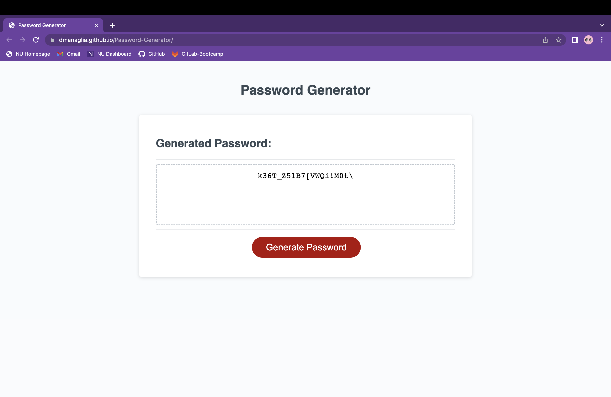
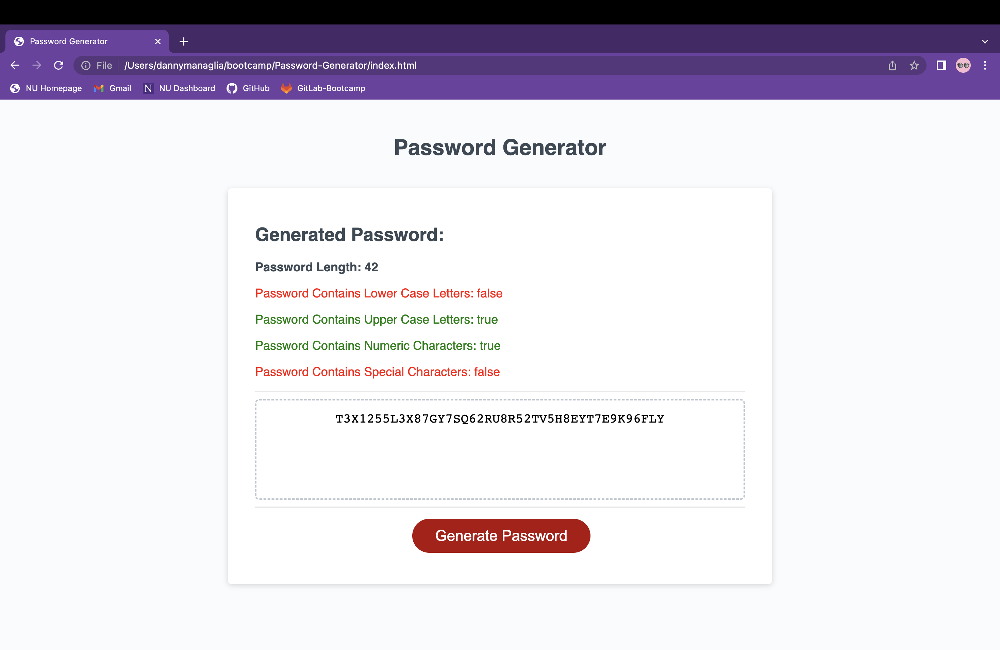

# Password-Generator

There are so many websites with logins these days it is hard for users to keep coming up with new passwords to ensure the best security. That's why I have created a random password generator! The results are entirely random and the webpage gives users the option of how long they want their password to be, as well as what kinds of characters it will contain. By prompting the user for their password criteria the program is able to generate a completely new random password at a click of a button. 

Each generated password is checked before being passed to the user as having all of the elements the user specified. Since it is random, it is possible (although unlikely) the first generated password will be missing one or two or even three types of characters.In this case the program will continue to generate a new password until it meets the criteria. Since the minimum length is 8 charcters it is a rare event, much like flipping a coin 8 times and each time it lands on heads. 

In order to ensure true randomness the program utilizes JavaScripts built in Math.random method a great deal in order to ensure there is no correlation between the generated passwords. 

The process was a great learning opportunity for debugging and practicing techniques to help figure out what was going wrong in my program. In the screenshot below I was struggling to figure out why my password generator was returning 'undefined' specifically when an initial generated password was faulty and the method had to be recalled from within itself. I eventually discovered an unexpected rule of calling a function from a statement and how that effects the code flow. It wasn't long before I got it working and learned not only useful information on functions, but how to traverse my code through utilizing the console in order to understand what is going on. 

## Installation

No installation necessary just click the link below to view!

[Click here to go to live link](https://dmanaglia.github.io/Password-Generator/)

## Usage

The password generator is easy to use and intuitive. Any information provided here can also be found on the page if you input anything that is considered invalid. By clicking the button on the bottom of the page labeled "Generate Password" the webpage will initialize a series of prompts:

Prompt #1: 'How many characters would you like your password to have?'

- Your password length cannot be less than 8 characters and it cannot exceed 128 characters.

- You may select cancel here to stop the code from generating a new password in case you are perticularly fond of the previous password generated.

Prompt #2 'Do you want your passowrd to contain lower case letters?'

Prompt #3 'Do you want your passowrd to contain upper case letters?'

Prompt #4 'Do you want your passowrd to contain numbers?'

Prompt #5 'Do you want your passowrd to contain special characters?'

- From here on the webpage asks what kind of characters you would like your password to have.

- Shown in the screenshot below, you have 2 choices for each of the four prompts: the "Ok" button implies "Yes" and the "Cancel" button implies "No"

- At this point you cannot stop the generation of a new password, by pressing cancel you are telling the webpage "No, I would not like that character in my password." You are not actually canceling the process. 

- There are four character types to choose from: lower case letters, upper case letters, numbers, and special characters (i.e. $@^_-> etc.) each has their own prompt that follows the same guidelines. 

- You may select "Ok" for as many character types as you would like, but you need to choose AT LEAST one character type. If you click "Cancel" for all four, the webpage will alert you with this built-in criteria and will automatically restart all four character selection prompts.

Exemplified in the screenshot below, once the 5th prompt is complete you will be given your new random password! You may click the button again and generate as many passwords as you would like! Just be sure to copy any passwords you like becuase once you generate a new password the old one is gone forever!

## Cedits

For the additional features added I utilized w3schools.com for information and syntax of creating new elements in HTML.
[w3schools](https://www.w3schools.com/js/js_htmldom_nodes.asp)

I also utilized mdn web docs for ideas on how to remove elements from HTML.
[mdn web docs removing HTML elements](https://developer.mozilla.org/en-US/docs/Web/API/Node/removeChild)

I also utilized another page on mdn web docs to learn the proper syntax of looping through an Object with a for loop.
[mdn web docs looping with Objects](https://developer.mozilla.org/en-US/docs/Web/JavaScript/Reference/Statements/for...in)

## License

Please refer to the LICENSE in the repo.

## Features

After I completed the code to generate a random password I decided to add a cool feature to the page that displays the user selected atributes of their generated password. Shown below I retrieved the user defined properties from my usrPassword Object and created new HTML elements displaying the property values. 

Adding the feature was good practice with DOM manipulation. It required some extra research, but it was all fairly simple and intuitive. I created a new div element to specifically change when I wanted to add new information about the newly generated password and when I wanted to delete the previously displaying information from the last generated password. 

I ended up changing some of the properties of my usrPassword Object to make it easier to loop through and access the specific information I wanted to display on the webpage. I also added simple if statements checking the values I was displaying in order to change the text color to green or red depending on whether the value to be displayed is true or false.

Ideally I would like to learn how to just change the color of the words "true" and "false" instead of the entire line, but overall it was a great learning opportunity and I think it came out looking great.